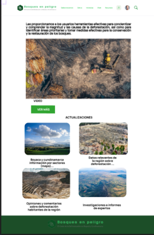
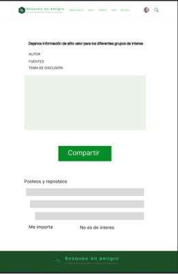

# 🌲 Forests at Risk Application - Bosques en Peligro App

<p align="center">
  A comprehensive web application for monitoring deforestation, sharing environmental information, and fostering community engagement around forest conservation in Colombia.
</p>

---

<h2 align="left">Index</h2>

- [🌲 Forests at Risk Application - Bosques en Peligro App](#-forests-at-risk-application---bosques-en-peligro-app)
  - [🧐 About ](#-about-)
    - [Key Objectives](#key-objectives)
  - [✨ Features ](#-features-)
    - [Frontend Features](#frontend-features)
    - [Backend Features](#backend-features)
  - [🏗️ Architecture ](#️-architecture-)
  - [🏁 Getting Started ](#-getting-started-)
    - [Prerequisites](#prerequisites)
    - [Installation ](#installation-)
  - [🎈 Usage ](#-usage-)
    - [Application Flow](#application-flow)
    - [User Registration](#user-registration)
    - [Creating Forum Topics](#creating-forum-topics)
  - [📚 API Documentation ](#-api-documentation-)
    - [Main Endpoints](#main-endpoints)
    - [Response Format](#response-format)
  - [🛠️ Built With ](#️-built-with-)
    - [Backend Technologies](#backend-technologies)
    - [Frontend Technologies](#frontend-technologies)
  - [📁 Project Structure ](#-project-structure-)
  - [🚀 Deployment](#-deployment)
    - [Backend Deployment](#backend-deployment)
    - [Frontend Deployment](#frontend-deployment)
    - [Docker Deployment (Optional)](#docker-deployment-optional)
  - [🔧 Configuration](#-configuration)
    - [Environment Variables](#environment-variables)
    - [MongoDB Setup](#mongodb-setup)
  - [🔮 Future Enhancements](#-future-enhancements)
  - [📸 Snapshots](#-snapshots)
  - [👨‍💻 Authors ](#-authors-)
  - [📄 License](#-license)

## 🧐 About <a name = "about"></a>

**Forests at Risk (Bosques en Peligro App)** is a full-stack web application designed to raise awareness about deforestation in Colombia and provide a platform for environmental data sharing and community engagement. The application serves as both an information hub and a forum for discussing environmental conservation topics.

### Key Objectives
- **Data Visualization**: Display deforestation statistics and environmental data by region
- **Community Forum**: Enable users to create discussion topics and share information
- **News & Articles**: Share environmental news and educational content
- **Project Showcase**: Highlight conservation projects and initiatives
- **User Management**: Secure user registration and authentication system

## ✨ Features <a name = "features"></a>

### Frontend Features
- **Home Page**: Interactive slider, project showcase, and about section
- **Data Dashboard**: Deforestation statistics by region and year
- **News Section**: Environmental articles and updates
- **Discussion Forum**: User-generated topics and responses
- **Projects Gallery**: Conservation initiatives and programs
- **User Authentication**: Registration and login system
- **Responsive Design**: Bootstrap-based responsive UI

### Backend Features
- **User Management**: Registration, authentication with SHA-256 encryption
- **Forum System**: Topic creation and response management
- **Data Management**: Deforestation surface area tracking by region
- **Content Management**: News and publication handling
- **Project Management**: Conservation project information
- **Region Management**: Geographic region data
- **Secure API**: RESTful endpoints with proper error handling

## 🏗️ Architecture <a name = "architecture"></a>

The application follows a modern full-stack architecture:

```
┌─────────────────┐    HTTP/REST API    ┌─────────────────┐
│   Angular 17    │ ◄─────────────────► │  Spring Boot    │
│   Frontend      │                     │   Backend       │
│                 │                     │                 │
│ • Components    │                     │ • Controllers   │
│ • Services      │                     │ • Services      │
│ • Routing       │                     │ • Repositories  │
│ • Bootstrap UI  │                     │ • Models        │
└─────────────────┘                     └─────────────────┘
                                                │
                                                │ MongoDB
                                                ▼
                                        ┌─────────────────┐
                                        │   MongoDB       │
                                        │   Database      │
                                        │                 │
                                        │ • Collections   │
                                        │ • Documents     │
                                        │ • Cloud Atlas   │
                                        └─────────────────┘
```

## 🏁 Getting Started <a name = "getting_started"></a>

### Prerequisites

Before running the application, ensure you have the following installed:

```bash
# Backend Requirements
Java 17 or higher
Maven 3.6+
MongoDB (local) or MongoDB Atlas account

# Frontend Requirements
Node.js 18+
npm 9+
Angular CLI 17+
```

### Installation <a name = "installation"></a>

1. **Clone the repository**
```bash
git clone https://github.com/danieltorrez29/Bosques-en-Peligro-Application.git
cd Bosques-en-Peligro-Application
```

2. **Backend Setup**
```bash
cd backend

# Install dependencies and compile
mvn clean install

# Configure MongoDB connection
# Edit src/main/resources/application.properties
# Update the MongoDB URI with your credentials

# Run the Spring Boot application
mvn spring-boot:run
```
The backend will start on `http://localhost:8080`

3. **Frontend Setup**
```bash
cd frontend

# Install dependencies
npm install

# Start the development server
ng serve
```
The frontend will start on `http://localhost:4200`

## 🎈 Usage <a name="usage"></a>

### Application Flow

1. **Home Page**: Navigate to the main page to view project overview
2. **Data Visualization**: Visit `/datos` to view deforestation statistics
3. **News**: Browse environmental articles at `/noticias`
4. **Forum**: Create topics and participate in discussions at `/post`
5. **Projects**: Explore conservation projects at `/proyectos`
6. **User Account**: Register at `/registro` or login at `/login`

### User Registration
```http
POST http://localhost:8080/usuarios
Content-Type: application/json

{
    "nombre": "John Doe",
    "numero": "+57123456789",
    "correo": "john.doe@example.com",
    "contrasena": "securePassword123"
}
```

### Creating Forum Topics
```http
POST http://localhost:8080/temas
Content-Type: application/json

{
    "nombre": "Deforestation in the Amazon",
    "usuario": {
        "id_usuario": "USER_ID_HERE"
    }
}
```

## 📚 API Documentation <a name = "api"></a>

### Main Endpoints

| Resource | Method | Endpoint | Description |
|----------|--------|----------|-------------|
| Users | GET | `/usuarios` | Get all users |
| Users | POST | `/usuarios` | Create new user |
| Users | GET | `/usuarios/{id}` | Get user by ID |
| Users | PUT | `/usuarios/{id}` | Update user |
| Users | DELETE | `/usuarios/{id}` | Delete user |
| Topics | GET | `/temas` | Get all forum topics |
| Topics | POST | `/temas` | Create new topic |
| Regions | GET | `/regiones` | Get all regions |
| Surface | GET | `/superficie` | Get deforestation data |
| Surface | POST | `/superficie` | Add deforestation data |
| Projects | GET | `/proyectos` | Get conservation projects |
| News | GET | `/noticias` | Get news articles |

### Response Format
```json
{
    "status": "success",
    "data": {
        "id_usuario": "507f1f77bcf86cd799439011",
        "nombre": "John Doe",
        "correo": "john.doe@example.com"
    }
}
```

## 🛠️ Built With <a name = "built_with"></a>

### Backend Technologies
- **Spring Boot 3.2.5** - Java application framework
- **Spring Data MongoDB** - Database integration
- **Spring Web** - RESTful web services
- **Lombok** - Boilerplate code reduction
- **Maven** - Dependency management
- **MongoDB Atlas** - Cloud database service

### Frontend Technologies
- **Angular 17.3.0** - Frontend framework
- **TypeScript** - Programming language
- **Bootstrap 5.3.3** - CSS framework
- **Bootstrap Icons** - Icon library
- **RxJS** - Reactive programming
- **Angular Router** - Navigation

## 📁 Project Structure <a name = "structure"></a>

```
Bosques-en-Peligro-App/
│
├── backend/                          # Spring Boot Backend
│   ├── src/main/java/BackEndBosques/Foro/
│   │   ├── Controladores/           # REST Controllers
│   │   │   ├── ControladorUsuario.java
│   │   │   ├── ControladorTemas.java
│   │   │   ├── ControladorSuperficie.java
│   │   │   └── ...
│   │   ├── Model/                   # Data Models
│   │   │   ├── Usuario.java
│   │   │   ├── TemasForo.java
│   │   │   ├── SuperficieDeforestada.java
│   │   │   └── ...
│   │   ├── Repositorios/           # Data Repositories
│   │   ├── Service/                # Business Logic
│   │   └── ForoApplication.java    # Main Application
│   ├── src/main/resources/
│   │   └── application.properties  # Configuration
│   └── pom.xml                     # Maven Configuration
│
├── frontend/                       # Angular Frontend
│   ├── src/app/
│   │   ├── componetes/            # Reusable Components
│   │   │   ├── header/
│   │   │   ├── footer/
│   │   │   ├── slider/
│   │   │   └── ...
│   │   ├── page/                  # Page Components
│   │   │   ├── home/
│   │   │   ├── datos/
│   │   │   ├── noticias/
│   │   │   ├── post/
│   │   │   └── ...
│   │   ├── app.routes.ts          # Routing Configuration
│   │   └── app.component.ts       # Root Component
│   ├── src/assets/                # Static Assets
│   ├── angular.json               # Angular Configuration
│   └── package.json               # Dependencies
│
├── img/                           # Project Images
├── mockups/                       # Design Mockups
└── README.md                      # Project Documentation
```

## 🚀 Deployment

### Backend Deployment
```bash
# Build the application
mvn clean package

# Run with production profile
java -jar target/Foro-0.0.1-SNAPSHOT.jar --spring.profiles.active=prod
```

### Frontend Deployment
```bash
# Build for production
ng build --configuration production

# Serve with a web server (nginx, apache, etc.)
# Files will be in dist/bosques-en-peligro/
```

### Docker Deployment (Optional)
```dockerfile
# Backend Dockerfile
FROM openjdk:17-jdk-slim
COPY target/Foro-0.0.1-SNAPSHOT.jar app.jar
EXPOSE 8080
ENTRYPOINT ["java","-jar","/app.jar"]
```

## 🔧 Configuration

### Environment Variables
Create an `application-prod.properties` file for production:

```properties
spring.application.name=Foro
spring.data.mongodb.uri=${MONGODB_URI}
spring.data.mongodb.database=${MONGODB_DATABASE}
server.port=${PORT:8080}
```

### MongoDB Setup
1. Create a MongoDB Atlas account
2. Create a new cluster
3. Set up database access and network access
4. Update the connection string in `application.properties`

## 🔮 Future Enhancements

- [ ] Real-time chat functionality in the forum
- [ ] Interactive maps for deforestation data
- [ ] Mobile application (React Native/Flutter)
- [ ] Machine learning for environmental predictions
- [ ] Integration with government environmental APIs
- [ ] Multi-language support
- [ ] Advanced data analytics dashboard
- [ ] Email notifications for forum activities

## 📸 Snapshots

Here are some representative screenshots of the application:

[](https://raw.githubusercontent.com/danieltorrez29/Bosques-en-Peligro-Application/refs/heads/master/mockups/login.PNG)
[](https://raw.githubusercontent.com/danieltorrez29/Bosques-en-Peligro-Application/refs/heads/master/mockups/home.PNG)
[](https://raw.githubusercontent.com/danieltorrez29/Bosques-en-Peligro-Application/refs/heads/master/mockups/forum.png)

## 👨‍💻 Authors <a name = "authors"></a>

- [@danieltorrez29](https://github.com/danieltorrez29) – Systems and Computer Engineer - Database Specialist.

## 📄 License

This project is licensed under the MIT License - see the [LICENSE](LICENSE) file for details.